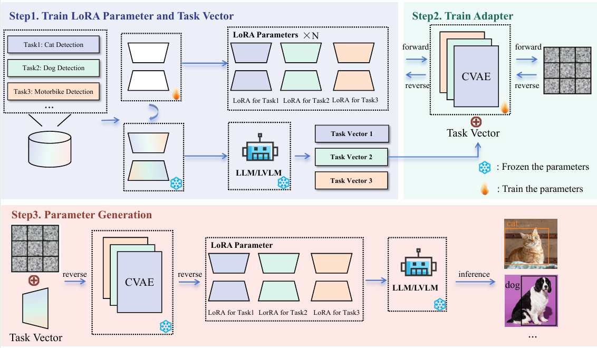

# ICM-LoRA

[English](README.en.md) | [简体中文](README.md)  



## 📌 Data Preparation

### 📂 Dataset Preparation
Download the dataset to the `data` folder. The training format for Florence2 is as follows:

```json
{
  "id": "image_0001",
  "image_path": "/path/to/images/image_0001.jpg",
  "height": 480,
  "width": 640,
  "suffix": "dog<loc_120><loc_85><loc_340><loc_250> person<loc_50><loc_30><loc_150><loc_200> car<loc_400><loc_150><loc_600><loc_300>"
}
```

---

## 🔧 Training LoRA Parameters
Use the `train_lora_arg.py` script in the `train_lora` folder to fine-tune the large model with LoRA and generate LoRA parameters for different ranks (1-8).

---

## 🔄 Processing LoRA Parameters
### 🔹 Flatten and Normalize LoRA Parameters
1. Run the `reformat_lora_param.py` script to mark the original LoRA parameters with `epoch` and move them to the `param` folder.
2. Run the `utils/normalizeLoraWeight_small.py` script to flatten and normalize the LoRA parameters.
3. Observe the dimension of the flattened LoRA parameters, which will be used as `input_dim` for CVAE.

```bash
#!/bin/bash

SOURCE_PATH=../train_lora/model_checkpoints/xxxx # e.g., dog-r=8
TARGET_PATH=../data/param_data/xxx  # e.g., dog-r=8

python3 reformat_lora_param.py --source_path "$SOURCE_PATH" --target_path "$TARGET_PATH"
python3 normalizeLoraWeight_small.py --dataset_path "$TARGET_PATH"
```

---

## 🏗️ Training the Parameter Generator
### 🔹 Obtaining Task Vector
Use the `ICL/last_time_step_icl.py` script:
- Modify the dataset path.
- Specify the LoRA fine-tuned model.
- Set `output_dir` to obtain the final `hidden_state` (`decoder_avg_hidden_state`).
- Observe the shape of the `task_vector`, which will be used as `condition_dim` for CVAE.

### 🔹 Training CVAE
Train the CVAE model using `TrainScript_CVAE.py`.

```bash
python3 TrainScript_CVAE.py \
  --train_data_dir ../data/xxxx/normalized_data \
  --condition_dim xxx \
  --input_dim xxxxx \
  --task_vector_path xxxxx \
  --checkpoint_dir xxx 
```

---

## 🔄 LoRA Reconstruction
Use `utils/ReconstructLora_cvae.py` to sample and reconstruct LoRA.

```bash
python3 ReconstructLora_cvae.py \
  --train_data_dir ../data/xxxx/normalized_data \
  --condition_dim xxx \
  --input_dim xxxxx \
  --task_vector_path xxxxx \
  --cvae_checkpoint_path xxx \
  --datasetname "dog-r=8" \
  --normalized_lora_path xxx \
  --rank 8 # or 1, 2, 4, 8
```

---

## ✅ Testing
Run `test.py` to test the process.

```bash
python3 test.py \
  --download_location xxx \
  --datasetname xxx \
  --generated_lora xxx \
  --rank xxx
```
